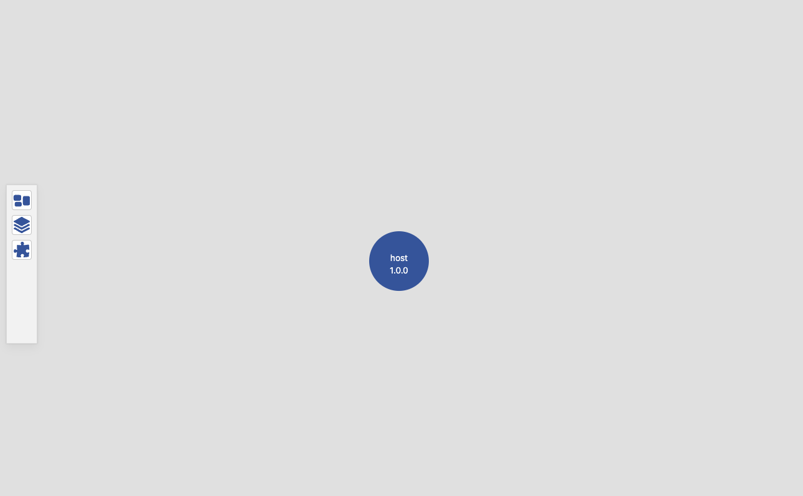
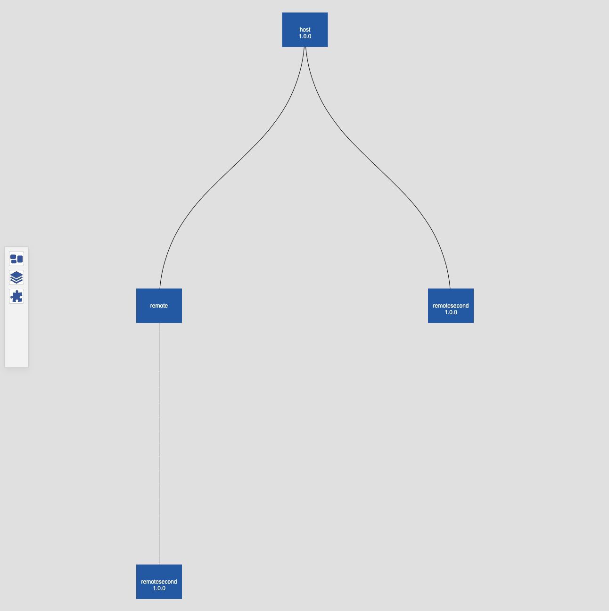
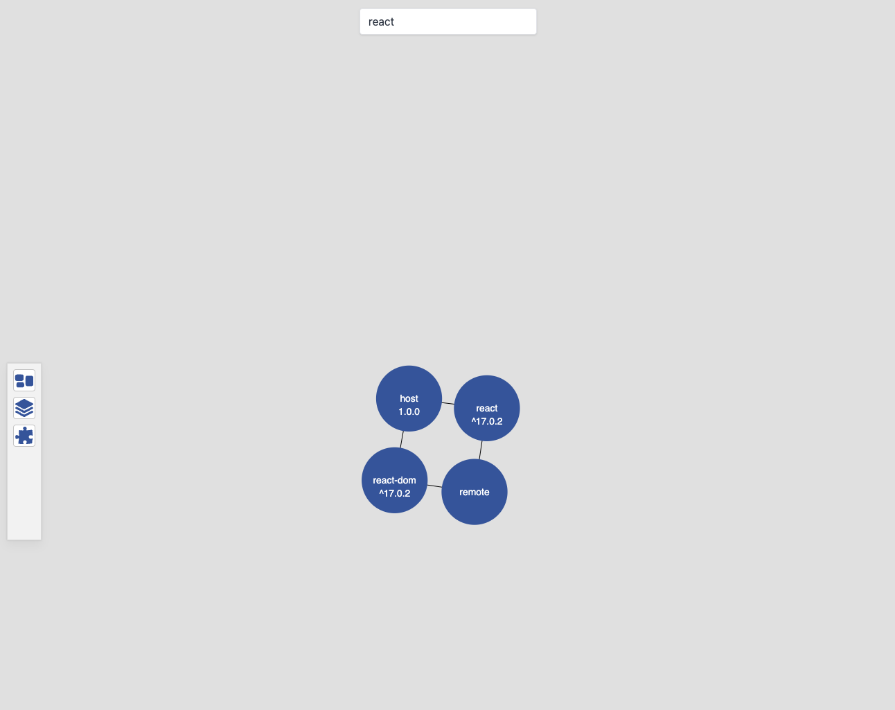

# Module Federation Dashboard Site

This site serves as a module federation dashboard for visualizing federated modules, their relationships and their shared dependencies. This is a WIP.

## Examples

Host applications - these are top level applications which are similar to a "shell" in concept.

Host application dependencies - view related modules in context of a host

Modules - view all published modules, where size correlates to number of relationships

Dependencies - view all shared dependencies of modules, search by dependency

## How to use

This site uses Remix and Neo4J for storing the data. There is a docker compose file included in this repo that is already configured. To run the site:

_docker compose up_

The site should be available on - [http://localhost](http://localhost)
If you want to access neo4j directly - [http://localhost:7474/](http://localhost:7474)

The usage of neo4j will let you write queries directly against the data if needed.

## Feedback

This is a WIP and subject to change. Visualizations for dependencies is difficult due to super common dependencies like react. Please open issues in this repo for
feature requests or bugs.
